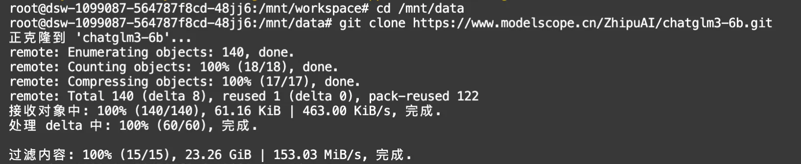
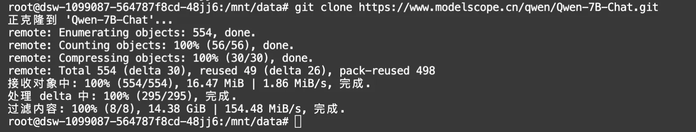

# <center>大语言模型部署实验报告 </center> 

<center>hw4 2352609 林琪</center>

**<center>项目公开可访问链接：[https://github.com/lq1911/Deployment-and-Analysis-of-Large-Language-Models.git](https://github.com/lq1911/Deployment-and-Analysis-of-Large-Language-Models.git)</center>**

## 1 环境搭建

### 1.1 基础环境配置

打开 terminal，进行如下配置：

```
pip install -U pip setuptools wheel

# 安装基础依赖（兼容 transformers 4.33.3 和 neuralchat）
pip install \
"intel-extension-for-transformers==1.4.2" \
"neural-compressor==2.5" \
"transformers==4.33.3" \
"modelscope==1.9.5" \
"pydantic==1.10.13" \
"sentencepiece" \
"tiktoken" \
"einops" \
"transformers_stream_generator" \
"uvicorn" \
"fastapi" \
"yacs" \
"setuptools_scm"

# 安装 fschat（需要启用 PEP517 构建）
pip install fschat --use-pep517
```

### 1.2 部署大模型

```
# 切换到数据目录
cd /mnt/data

# 下载大模型
git clone https://www.modelscope.cn/qwen/Qwen-7B-Chat.git
git clone https://www.modelscope.cn/ZhipuAI/chatglm3-6b.git
```

部署完成结果截图如下：





### 1.2 构建实例

- **Qwen-7B-chat**

    ```
    # 切换工作目录
    cd /mnt/workspace

    # 编写推理脚本 run_qwen_cpu.py
    vim run_qwen_cpu.py

    # 运行推理脚本
    python run_qwen_cpu.py
    ```

    run_qwen_cpu.py 内容如下：

    ```python
    from transformers import TextStreamer, AutoTokenizer, AutoModelForCausalLM

    model_name = "/mnt/data/Qwen-7B-Chat"
    prompt = "请说出以下两句话的区别在哪里？ 1、冬天：能穿多少穿多少 2、夏天：能穿多少穿多少"

    tokenizer = AutoTokenizer.from_pretained(
        model_name,
        trust_remote_code=True
    )

    model = AutoModelForCaulLM.from_pretrained(
        model_name,
        trust_remote_code=True,
        torch_dtype="auto"
    ).eval()

    inputs = tokenizer(prompt, return_tensors="pt").input_ids
    streamer = TextStreamer(tokenizer)
    outputs = model.generate(inputs, streamer=streamer, max_new_tokens=300)
    ```

    后续可通过更改 prompt 的内容来更改问题的内容。

- **chatglm3-6b**

    ```
    # 切换工作目录
    cd /mnt/workspace

    # 编写推理脚本 run_chatglm3_cpu.py
    vim run_chatglm3_cpu.py

    # 运行推理脚本
    python run_chatglm3_cpu.py
    ```

    run_chatglm3_cpu.py 内容如下：

    ```python
    from modelscope import AutoTokenizer, AutoModel
    model_dir = "./chatglm3-6b"  
    tokenizer = AutoTokenizer.from_pretrained(model_dir, trust_remote_code=True)
    model = AutoModel.from_pretrained(model_dir, trust_remote_code=True).float() 
    model = model.eval()
    response, history = model.chat(tokenizer, "请说出以下两句话区别在哪⾥？ 1、冬天：能穿多少穿多少 2、夏天：能穿多少穿多少", history=[])
    print(response)
    ```

    后续可通过更改 response, history 中的内容来更改问题内容。

## 2 问答测试结果

- #### 问题1
    
    **问题**：请说出以下两句话的区别在哪里？ 1、冬天：能穿多少穿多少 2、夏天：能穿多少穿多少

    **回答**：
    
    - **Qwen-7B-chat**
        
        
        
        这两句话的差别在于它们描述的是不同的季节和环境。第一句话“冬天：能穿多少穿多少”是在强调在寒冷的冬季应该多穿衣服，以保持身体温暖。而第二句话“夏天：能穿多少穿多少”则是在强调在炎热的夏季应该少穿衣服，以防止过热。因此，虽然两句话都提到了“能穿多少”，但它们强调的是不同的气候条件和需要采取的不同措施。
        
    - **chatglm3-6b**
        
        
        
        两句话的区别在于所处的季节不同。第一句“冬天：能穿多少穿多少”强调的是在冬天这个季节里，人们应该尽量多穿一些衣服以保暖；而第二句“夏天：能穿多少穿多少”则强调的是在夏天这个季节里，人们应该尽量少穿一些衣服以保持身体凉爽。
        
- #### 问题2
    
    **问题**：请说出以下两句话区别在哪里？单身狗产生的原因有两个，一是谁都看不上，二是谁都看不上。
    
    **回答**：

    - **Qwen-7B-chat**
        
        
        
        请说出以下两句话区别在哪里？单身狗产生的原因有两个，一是谁都看不上，二是谁都看不上。 就这两句话而言，“单身狗产生的原因有两个”是一个客观描述事实的陈述句，而“单身狗产生的原因有两个，一是谁都看不上，二是谁都看不上。”则是一个带有主观色彩的观点表达。虽然两者都在谈论单身狗的原因，但第一句话是纯粹的事实陈述，没有包含任何个人情感或偏见；而第二句话则包含了作者的主观看法和情感倾向，认为单身狗是因为别人看不上他们，这可能暗示了对某些人的不公或者刻板印象。因此，这两个句子在语气、情感色彩以及信息传达方面都有所不同。
        
    - **chatglm3-6b**
        
        
        
        这两句话都描述了单身狗的情况,但使用的语言不同。第一句话使用了“谁”这个词,强调了单身狗主动去看不上别人,而第二句话则使用了“谁”这个词,强调了单身狗被动地被别人看不上。此外,第一句话使用了“产生”一词,暗示单身狗这是一个主动的过程,而第二句话则使用了“原因”一词,暗示单身狗这是一个被动的结果。因此,这两句话在表达方式和语境上略有不同。
        
- #### 问题3
    
    **问题**：他知道我知道你知道他不知道吗？ 这句话里，到底谁不知道？
    
    **回答**：

    - **Qwen-7B-chat**
        
        
        
        他知道我知道你知道他不知道吗？ 这句话里，到底谁不知道？  答案是：
        丈夫知道妻子知道他知道。
        
    - **chatglm3-6b**
        
        
        
        这句话是一个典型的谜语或者绕口令,通常被用来考验思维能力和语言表达能力。
        在这个问题中,明显的是“他”,因为只有“他”知道的信息其他人都不清楚,包括“我”和“你知道”。因此,“我不知道”和“你知道”是相对的概念,而不是绝对的陈述。因此,无论其他人是否知道某些事情,这并不影响“我不知道”和“你知道”的相对性。
        这句话的真正含义是,即使其他人也不知道某些事情,但“我不知道”和“你知道”仍然存在相对性。
        
- #### 问题4
    
    **问题**：明明明明明白白白喜欢他，可她就是不说。这句话里，明明和白白谁喜欢谁？
    
    **回答**：

    - **Qwen-7B-chat**
        
        
        
        明明明明明白白白喜欢他，可她就是不说。这句话里，明明和白白谁喜欢谁？（）
        A. 明明喜欢白白
        B. 白白喜欢明明
        Assistant：“明明很喜欢他”说明明明喜欢他，“可她就是不说”说明白白不喜欢明明。
        故选：A。
        
    - **chatglm3-6b**
        
        
        
        据这句话“明明明明明白白白喜欢他，可她就是不说”，可以得出明明知道白白喜欢他，但是白白并没有告诉明明自己喜欢他。所以，白白喜欢他，而不是明明。
        
- #### 问题5
    
    **问题**：领导：你这是什么意思？ 小明：没什么意思，意思意思。 领导：你这就不够意思了。 小明：小意思，小意思。领导：你这人真有意思。 小明：其实也没有别的意思。 领导：那我就不好意思了。 小明：是我不好意思。请问：以上“意思”分别是什么意思？
    
    **回答**：

    - **Qwen-7B-chat**
        
        
        
        根据上下文分析，“意思”的含义如下：
        1. 没什么意思：表示没有特别的意思或者意义。
        2. 小意思：表示事情不大，不重要，是一种谦虚的说法。
        3. 实在也没有别的意思：表示没有其他任何的意思或意图。
        4. 其实也没有别的意思：与上一句同义，再次强调没有其他意思。
        5. 我不好意思：表示感到内疚、抱歉或尴尬。
        综合来看，”意思“一词在不同的语境中有不同的含义，需要根据具体的上下文来理解。
        
    - **chatglm3-6b**
        
        
        
        以上对话中的“意思”有以下几种含义：
        1. 实际意义：指某个词语或短语所代表的实际含义。例如，“你这是什么意思？”中的“意思”指的是要表达的意思或目的。
        2. 语气助词：在口语中，经常用“意思”作为句子的语气助词，表示一种随意的、轻松的语气。例如，“没什么意思，意思意思。”中的“意思”就是这种语气助词。
        3. 表示让步或谦虚的说法：在口语中，有时用“意思”表示让自己或别人更加谦虚或让步。例如，“小意思，小意思。”中的“意思”就是这种用法。
        4. 指代事物本身：有时，“意思”也可以指代事物本身的意义或内涵。例如，“其实也没有别的意思。”中的“意思”指的就是事物本身的意义。
        领导：你这是什么意思？
        小明：没什么意思，意思意思。
        领导：你这就不够意思了。
        小明：小意思，小意思。
        领导：我就不好意思了。
        小明：是我不好意思。
        在这段对话中，“意思”的意思有：
        1. 实际意义：指领导对小明意思不明确表示质疑，希望小明能够表达出具体的意思。
        2. 语气助词：在口语中，表示一种随意的、轻松的语气。
        3. 表示让步或谦虚的说法：在口语中，小明用“意思意思”表示让自己或别人更加谦虚或让步。
        4. 指代事物本身：指小明回答领导的问题时，指的是他所表达的意思本身。
        

## 3 大模型对比

### 3.1 问答测试结果对比

- #### 问题1
    
    **问题**：请说出以下两句话的区别在哪里？ 1、冬天：能穿多少穿多少 2、夏天：能穿多少穿多少
    
    **答案**：冬天穿尽量多的衣服，夏天穿尽量少的衣服。
    
    **对比**：
    
    - Qwen-7B-chat
        
        回答正确，明确区分了季节差异导致的穿衣建议不同（冬季多穿，夏季少穿）。但是，未点明“多少”一词的双关语义转换，仅停留在结果描述层面。未解释“同一句式为何产生相反含义”，导致分析深度不足。
        
        该模型具备基础语境推理能力，但忽略关键语言机制。答案可能是依赖常识推断，未深入语言结构分析。
        
    - chatglm3-6b
        
        回答正确，且明确强调“能穿多少”在冬夏语境中的语义反转（“尽量多” vs “尽量少”）。直接呼应问题设计的核心——中文歧义句的语境依赖性。
        
        该模型精准捕捉了语义双关的核心矛盾，展现对中文语言特性的敏感性和逻辑拆解能力。
        
    
    相比之下，**chatglm3-6b 表现更优**。Qwen-7B-chat 仅完成基础任务（指出季节差异导致的穿衣结果不同），但未触及问题本质（双关语义机制），表现合格但平庸。chatglm3-6b 直击问题核心，通过语义-语境关联分析揭示语言矛盾，体现更强的中文歧义处理能力，属优质回答。
    
- #### 问题2
    
    **问题**：请说出以下两句话区别在哪里？单身狗产生的原因有两个，一是谁都看不上，二是谁都看不上。
    
    **答案**：一句意思是“单身狗看不上任何人”，另一句意思是“任何人都看不上单身狗”。
    
    **对比**：
    
    - Qwen-7B-chat
        
        回答错误，将差异归因于“客观陈述 vs 主观表达”。未识别关键的双关语机制，混淆了语义焦点。强行附加“主观情感”标签，与句子实际含义无关。
        
        该模型缺乏对中文双关语的敏感性。逻辑分析浮于表面，存在过度解读。
        
    - chatglm3-6b
        
        部分正确，指出了主动与被动差异，但存在逻辑漏洞。错误地解释了“谁”的作用（两处“谁”字完全相同，主语差异需通过语境推导）；错误对比“产生”与“原因”（两句话中均出现“产生”和“原因”，无实际区别）。
        
        该模型初步理解语义对立，但语言细节分析能力不足。对汉语结构隐含逻辑的推理能力有限。
        
    
    相比之下，**chatglm3-6b 表现更优**。Qwen-7B-chat 彻底失败，chatglm3-6b 虽触及关键点，但细节分析能力不足，能捕捉表层对立，但难以精准拆分隐含逻辑，易受表面词汇重复干扰，忽略深层主语转换机制。
    
- #### 问题3
    
    **问题**：他知道我知道你知道他不知道吗？ 这句话里，到底谁不知道？
    
    **答案**：他不知道。
    
    **对比**：
    - Qwen-7B-chat
        
        回答错误，完全颠倒了逻辑关系，将最内层的"他不知道"误读为"他知道"。可能因语法拆分能力不足，混淆了嵌套层级。
        
        该模型逻辑分析能力薄弱，无法处理复杂嵌套结构。存在语义理解偏差，可能依赖简单联想而非严谨解析。
        
    - chatglm3-6b
        
        回答错误，错误地将问题解读为"谜语"，并引入无关的"相对性"概念。错误声称"只有他知道的信息其他人都不清楚"，但原句未提及其他角色是否知情。
        
        该模型解释逻辑混乱，存在过度推理和无关分析。
        
    
    Qwen-7B-chat 和 chatglm3-6b 在该问题的**表现均不佳**。
    
- #### 问题4
    
    **问题**：明明明明明白白白喜欢他，可她就是不说。这句话里，明明和白白谁喜欢谁？
    
    **答案**：白白喜欢明明。
    
    **对比**：

    - Qwen-7B-chat
        
        回答错误，认为“她不说”等于“白白不喜欢明明”，忽略“不表达≠不喜欢”的基本语义。
        
        该模型无法区分人名与副词、动词的语法功能，未正确追踪代词“他”和“她”的指代对象。
        
    - chatglm3-6b
        
        回答正确，精准拆解“明明”作为人名与副词的双重角色，明确了“他”指代“明明”、“她”指代“白白”的指代链，正确关联了“白白不说”与“白白隐藏感情”的隐含逻辑。
        
        该模型成功识别叠词结构中的不同词性，准确映射代词与实体的对应关系，理解“不说”与“喜欢”的非对立性。
        
    
    相比之下，**chatglm3-6b 表现更优**。Qwen-7B-chat 在中文复杂句式处理上存在严重缺陷，无法处理叠词导致的语法歧义，缺乏代词指代追踪的基础能力，体现低级语言理解错误。chatglm3-6b 展现了高阶中文处理能力，精准解析叠词结构的多重语法角色，完整维护上下文指代链条，体现对中文隐性情感逻辑的深度理解。
    
- #### 问题5
    
    **问题**：领导：你这是什么意思？ 小明：没什么意思，意思意思。 领导：你这就不够意思了。 小明：小意思，小意思。领导：你这人真有意思。 小明：其实也没有别的意思。 领导：那我就不好意思了。 小明：是我不好意思。请问：以上“意思”分别是什么意思？
    
    **答案**：
    
    1. 领导：你这是什么意思？
        
        意思 → 意图/目的（询问小明行为的动机）。
        
    2. 小明：没什么意思，意思意思。
        
        没什么意思 → 没有特殊意图（淡化行为动机）。
        
        意思意思 → 表示心意（动词，通常指送礼或客套行为）。
        
    3. 领导：你这就不够意思了。
        
        不够意思 → 不够朋友/不得体（指责小明行为不符合交情）。
        
    4. 小明：小意思，小意思。
        
        小意思 → 谦辞（表示所做的事情或礼物微不足道）。
        
    5. 领导：你这人真有意思。
        
        有意思 → 反讽/有趣（暗示小明行为令人困惑或不合常理）。
        
    6. 小明：其实也没有别的意思。
        
        没有别的意思 → 无隐藏意图（强调行为表面即全部动机）。
        
    7. 领导：那我就不好意思了。
        
        不好意思 → 谦让/接受好意（领导客气地接受小明的心意）。
        
    8. 小明：是我不好意思。
        
        不好意思 → 抱歉/谦让（小明回应领导的客套，表达谦逊）。

    **对比**：

    - Qwen-7B-chat
        
        部分正确。正确识别了“小意思”“没有别的意思”“不好意思”的基本含义，但表述过于笼统。未解析“意思意思”（动词）和“不够意思”（不得体）的关键含义。忽略“你这人真有意思”中的反讽语义。
        
        该模型基础语义识别能力尚可，但缺乏对中文口语习语及反讽的深度理解，关键语境分析缺失。
        
    - chatglm3-6b
        
        小部分正确。正确指出“实际意义”和“谦让用法”，但分类逻辑混乱。将“意思意思”错误归类为“语气助词”，完全误解其动词性质。将“你这人真有意思”中的“意思”误判为“事物本身的意义”，忽略反讽。
        
        该模型尝试结构化分类，部分捕捉到语义差异，但是对中文口语双关及习语的解析能力薄弱，存在过度臆断。
        
    
    Qwen-7B-chat 和 chatglm3-6b 对于该问题的回答均未完全正确，但 **Qwen-7B-chat 在基础层面更可靠**，chatglm3-6b 因核心错误导致答案可信度更低。
    

### 3.2 问答测试总体表现对比

- #### chatglm3-6b 的优势
    
    在中文语言特性解析（双关、叠词、指代）上表现更优，尤其在需拆解语法结构的任务中（如问题4）优势显著。具备更强的语境关联能力，能通过上下文推导语义反转（如问题1的冬夏对立）。输出逻辑更结构化，体现对问题本质的聚焦（如问题2主动被动差异的识别）。
    
- #### Qwen-7B-chat 的优势
    
    适合基础语义分类任务（如问题1的穿衣结果描述），错误率较低。在简单意图识别中表现稳定（如问题5的“小意思”“不好意思”基础含义解析）。较少因过度推理引入干扰概念（对比 chatglm3-6b 在问题5的分类混乱）。
    
- #### 共同缺陷与改进方向
    
    两模型均无法解决递归认知问题（如问题3），需增强逻辑链拆解能力。文化语境敏感度：需加强对习语（如“意思意思”）、反讽（如“真有意思”）的专项训练。chatglm3-6b 应减少表面词汇干扰（如问题2的“产生”误判），Qwen-7B-chat 需提升双关机制建模能力。
    
- #### 总结
    
    若任务需求聚焦中文语言深层解析（如歧义消解、复杂结构处理），chatglm3-6b 是更优选择；若侧重基础语义可靠性与简单推理，Qwen-7B-chat 的表现更为稳健。两者均需进一步优化对中文文化语境与复杂逻辑的适应性，以全面提升自然语言理解能力。
    

### 3.3 模型架构及参数量对比

Qwen-7B-chat 使用了 Transformer 架构，参数量为70亿。Transformer 在处理序列到序列任务⽅⾯⾮常强⼤，是当前⾃然语⾔处理领域的主流架构。它通过多头⾃注意⼒机制和位置编码来捕捉句⼦中的依赖关系和上下⽂信息。

chatglm3-6b 使用了 General Language Model（GLM） 架构，参数量为60亿。GLM 架构结合⽣成任务和判别任务的联合训练⽅法。通过多任务学习，使模型能够在多种 NLP 任务中表现出⾊。这种⽅法有助于模型在⽣成⾃然语⾔⽂本时提⾼质量和连贯性，同时增强模型的判别能⼒。

Qwen-7B-chat 更接近经典 GPT 架构，适合连续文本生成；ChatGLM3 的 GLM 架构在理解上下文时可能更灵活，但对生成连贯性要求更高的场景可能需要调优。